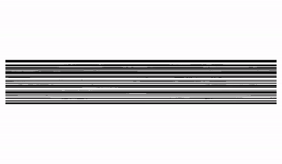

# Folder

Folder is a numerical tool for modelling deformation in layered media. It is developed in Matlab and compatible with Matlab versions from 2014b onwards.

Folder is documented in the Journal of Structural Geology article: 
["FOLDER: A numerical tool to simulate the development of structures in layered media"
by Marta Adamuszek, Marcin Dabrowski, and Daniel W. Schmid, doi:10.1016/j.jsg.2016.01.001](http://www.sciencedirect.com/science/article/pii/S0191814116300013). 



### Getting Started
Download the Matlab source code as a zip, unpack on your computer, and run 
```Matlab
folder
```

### Externals
FGT relies on the following external packages. They are included in the source, so no need to install separately.

 * [GUI Layout Toolbox by David Sampson](https://www.mathworks.com/matlabcentral/fileexchange/47982-gui-layout-toolbox)
 * [mutils by Marcin Krotkiewski and Marcin Dabrowski](https://sourceforge.net/projects/milamin/files)
 * [poly_stuff by Darren Engwirda](https://www.mathworks.com/matlabcentral/fileexchange/10391-fast-points-in-polygon-test)

 ### Authors

* Marta Adamuszek
* Marcin Dabrowski
* Dani Schmid